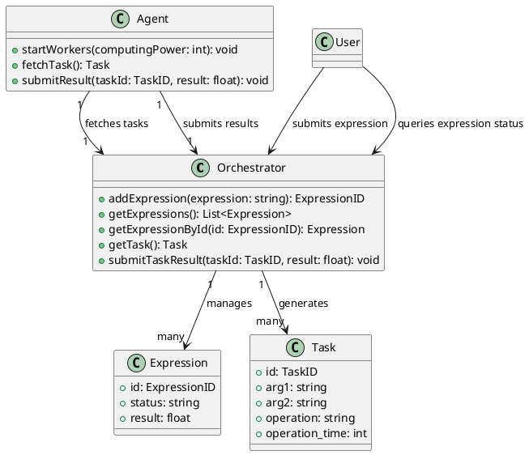

# Распределенный вычислитель арифметических выражений

## Описание проекта

Этот проект представляет собой распределенную систему для вычисления математических выражений. Он состоит из:

- **Оркестратора** – управляет вычислениями и распределяет задачи между агентами.
- **Агентов** – выполняют вычисления по запросу оркестратора.
- **API** – позволяет отправлять выражения на вычисление и получать результаты.

## Функциональность

- Поддержка базовых арифметических операций (`+`, `-`, `*`, `/`).
- Обработка скобок в выражениях.
- Поддержка математических функций (`sqrt(x)`, `sin(x)`, `cos(x)`, `log(x)`).
- Возможность работы с выражениями, содержащими произвольное количество пробелов.
- Распределение вычислений между несколькими агентами.
- Логирование запросов и результатов вычислений.

## Структура проекта

```
project-root/
│── cmd/
│   ├── orchestrator/  # Главный модуль оркестратора
│   ├── agent/         # Главный модуль агента
│
│── internal/
│   ├── orchestrator/  # Логика оркестратора
│   ├── worker/        # Логика вычислений
│   ├── api/           # Обработка HTTP-запросов
│
│── test/              # Тесты проекта
│── config/            # Конфигурационные файлы (например, config.yaml)
│── Dockerfile         # Контейнеризация проекта
│── docker-compose.yml # Запуск через Docker Compose
│── README.md          # Документация проекта
```

## Запуск проекта

### Локальный запуск

1. **Склонируйте репозиторий:**
   ```sh
   git clone <репозиторий>
   cd <папка_проекта>
   ```
2. **Запустите систему:**
   ```sh
   go run ./cmd/...
   ```
3. **Отправьте выражение на вычисление:**
   ```sh
   curl --location 'http://localhost:8080/evaluate' \
   --header 'Content-Type: application/json' \
   --data '{"expression": "(2+3)*sqrt(9)"}'
   ```

### Запуск с Docker

1. **Соберите контейнеры и запустите их:**
   ```sh
   docker-compose up --build
   ```
2. **Отправьте запрос на вычисление (аналогично локальному запуску).**

## Примеры запросов с `curl`

### Успешный запрос

```sh
curl --location 'http://localhost:8080/evaluate' \
--header 'Content-Type: application/json' \
--data '{"expression": "2+2*2"}'
```

**Ответ:**

```json
{
  "result": 6
}
```

### Ошибочный запрос (некорректное выражение)

```sh
curl --location 'http://localhost:8080/evaluate' \
--header 'Content-Type: application/json' \
--data '{"expression": "invalid+expression"}'
```

**Ответ:**

```json
{
  "error": "invalid expression"
}
```

## Схема работы системы





## Тестирование

1. **Запуск тестов:**
   ```sh
   go test ./test -v
   ```

## API

### POST `/evaluate`

Отправляет математическое выражение на вычисление.

#### Запрос:

```json
{
  "expression": "(2+3)*sqrt(9)"
}
```

#### Ответ:

```json
{
  "result": 15
}
```

## Дальнейшие улучшения

- Добавление логирования и мониторинга.
- Реализация интеграционных тестов.
- Оптимизация вычислений с кешированием.
